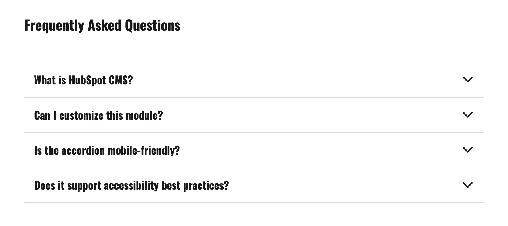
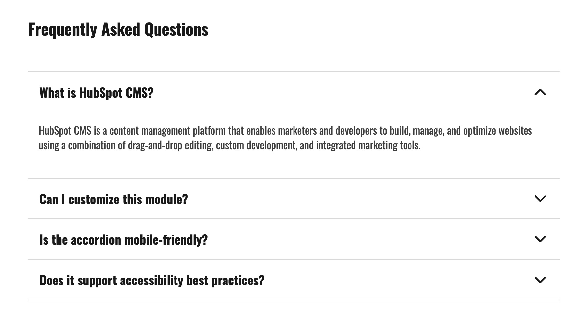

# HubSpot Accordion Module

Reusable HubSpot CMS accordion module focused on clean content structure, accessible interaction, and easy editor control.

## Overview

This project provides a reusable accordion for HubSpot pages that is simple for marketers to manage, performant on real pages, and reliable across desktop and mobile.

## Key Features

- Responsive layout for desktop and mobile
- Expand and collapse behavior with smooth transitions
- Lightweight vanilla JavaScript
- Editor-friendly content management through module fields
- Reusable module architecture for multiple page types

## Accessibility

- Keyboard-friendly interaction patterns
- ARIA attributes on interactive controls
- Visible focus states for keyboard navigation
- Reduced motion support via `prefers-reduced-motion`

## Technologies

- HubL
- HTML
- CSS
- JavaScript

## Installation

1. Add the module folder to your HubSpot theme modules directory.
2. Upload the theme or module to your HubSpot account.
3. Open a template or page in Design Manager.
4. Insert the module module into the layout.
5. Configure content and style fields in the page editor.

## Module Structure

- `modules/accordion.module/module.html` -> handles the HubL render output and markup structure.
- `modules/accordion.module/module.css` -> contains the component styles and responsive layout.
- `modules/accordion.module/module.js` -> interactive state and ARIA sync
- `modules/accordion.module/fields.json` -> defines editor controls for content and style.
- `modules/accordion.module/meta.json` -> registers the module in HubSpot.

## Customization

Main configurable fields include:

- Accordion title
- Repeater accordion items
- Accordion item heading and content
- Open/closed icon behavior
- Color styling
- Icon size and color

## Responsive Behavior

- Desktop: inline accordion interaction with smooth open/close transitions
- Mobile: the same interaction pattern remains usable in stacked layouts

## Why This Project

This module was built to prioritize maintainability and real production needs:

- Content team friendly
- Easy to style per page or theme context
- Good accessibility baseline
- Clean code organization for future extension

## Preview

### Closed State

Collapsed view.

### Open State

Expanded panel with clear visual state and content readability.

